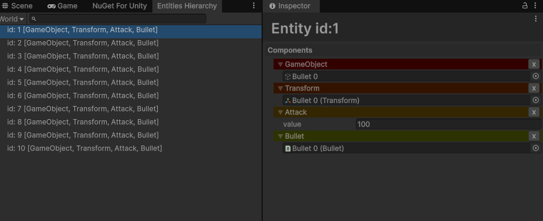

# DefaultEcs Unity EntityVisualize
This library displays a list of structure [DefaultEcs](https://github.com/Doraku/DefaultEcs) entities and their structure in the Unity Inspector.

# Requirement
- Unity 2022.1 higher

# Dependency
- [DefaultEcs](https://www.nuget.org/packages/DefaultEcs/)

## Git Path (Unity Package Manager)
```
https://github.com/kurobon-jp/DefaultEcs.Unity.EntityVisualize.git?path=Assets/
```

## Usage 

### Register World
```csharp
public class Main : MonoBehaviour
{
    private void Start()
    {
        var world = new World();
        ~
        EntityVisualizer.Register("main", world);
    }
}
```

Window -> DefaultEcs -> Entities Hierarchy<br>

